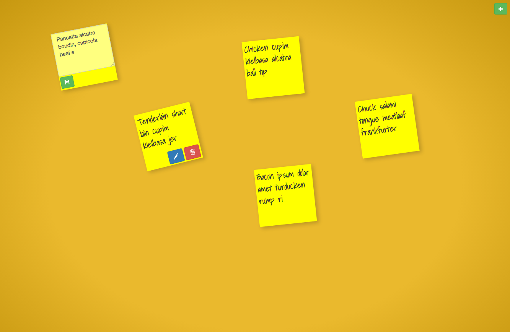

# note-board
A React application to create web notes!

## Dependencies:
    * babel-cli 6.4.0
    * babel-preset-react 6.5.0
    * react-0.13.3
    * bootstrap 3.3.4
    * jQuery UI 1.11.4

## Installation Notes:
```
npm install             // To install all the dependencies
npm run build           // To build the application
npm start               // To start the server on port 4000
                        // You can change your port # inside the package.json under the scripts object
```

## User Stories:
___
* User can create a note  (randomly position functionality)
* User can edit or delete a note
* User can save a new note
* User can drag the note position using jQuery UI

## Screen Shot:


